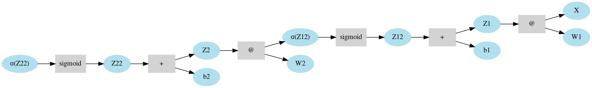

I'm starting an Autodiff project. Expect to see a lot of Gradients, Hessians, JAX and PyTorch. I'll be regularly updating. The progress of the project is intentially left as the last section of this page. See you!

## ToC:
1. [Abstract.](#abstract)
2. [Goals.](#goals)
3. [References.](references)
4. [Progress.](#progress)

### Abstract:
My main goal is to learn Pytorch/Jax, but also have a clear vision on what's happening underneath. I intend to build and train NNs from scratch, but have a PyTorch/Jax implelemention in parallel for correctness. Similar to what Andrej Karpathy have done in [Micrograd](https://github.com/karpathy/micrograd) with Pytorch.

### Goals:
* Be able to build and train NNs from scratch.
* Focus on Modularity, and Optimization of code.
* Check PyTorch/Jax & constantly use them to verify the correctness my code.
* Appreciate more the design choices of PyTorch/Jax, and don't take them for granted.

### References:
* Mathieu Blondel: Add github repo +  section from version of Murray (ML a probb perspective?)
* Bishop NN Chapter has a section on backprop
* Hennig (Lecture 8, Learning Representations)
* The idea is to start this project inspired by MICROGRAD (Andrej Karpathy)and TinyGrad (George Hotz) streams.

### Progress:

1. **[DONE]** Build a wrapper around **np.array**.
    * Add the necessary "magic" methods to the simple MLP work.
    * Make sure the forward pass is working fine.
2. **[DONE]** Using **graphviz**, build a visualizer of the Computation Graph (Forward Pass).
    * [Check this Guide](https://www.graphviz.org/pdf/dotguide.pdf) 
3. **[DONE]** Build Autodiff on a simple MLPs:     
    * Make this NN work: $L = \sigma(\sigma(X W_1 + b_1)W_2 + b_2)$
    * Pay attention to "topological" sorts.
    * Don't forget to zero_grad after each update
    * Don't forget to add grads, when one componenet is the "root" of multiple ops.
5. **[TO-DO]** Switch notation from X@W to W@X (feels more intuitive, could visual)
6. **[TO_DO]** Add more magic methods to the wrapper.
4. **[IN-PROGRESS]** Testing:
        * Automate testing.
        * Find a way to check the correctness, either:
            * **[DONE]** compare Vs. PyTorch.
            * (OR/AND) Manauly check Gradients.    
5. **[TO-DO]** Keep updating the plan, choices:, 
   * l1/l2 Regularization? Dropout? Batch Norm? fancy Optimizers?
   * Complex Architectures? (e.g., )

6. **[TO-DO]** Optimize:
    * Learn how to load mini-batches faster, perhaps using Iterators? Is it even useful?.
    * Improve your printing ("Cool people call it debugging skills")
    * Vertorize the 3-dim tensors manipulations (the softmax layer)

7. **[DONE]** Priliminaries:   
    1. Build a starting NN (no modularity whatsoever, just a script with a bunch of matrices):
         * Set up a working env:
         * Load MNIST, some pre-processing (baisc spliting and so one)
    2. Train a simple MLP to classify MNIST
        * Forward / Backward / Update.
        * Loop it and make sure the NN is learning.
        * Current accuracy around 94%.
            * Config: simple MLP, RELU, SIGMOID and quadrqatic loss.

8. Extra notes to keep in mind:
    * Check why the Cross-Entropy layer is performing (weirdly) worse.
    * See how you can replicate your settings with PyTorch/Jax.

